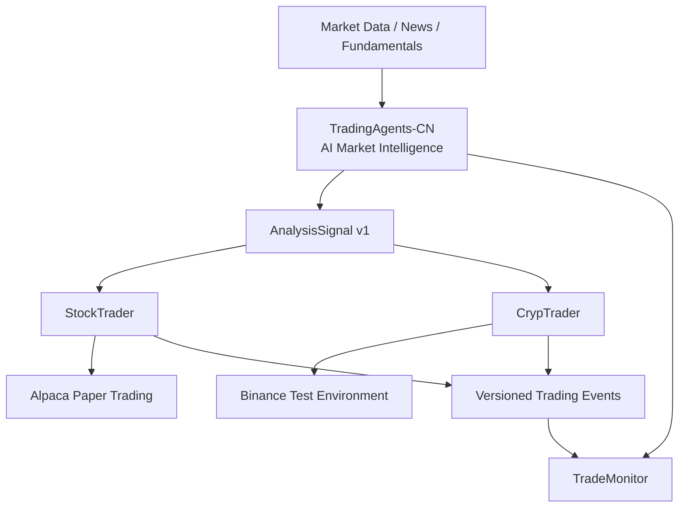
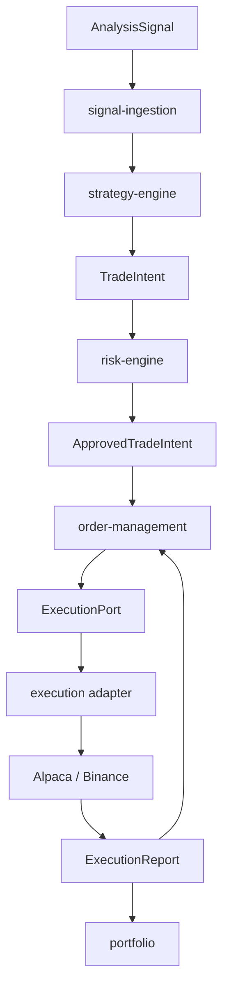
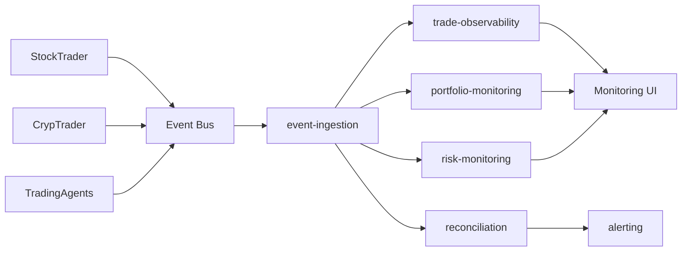

# TradingAgents-CN：下游交易平台集成架构

记录日期：2026-09-17。

本文是 `project-review-notes.md` 的下游服务演进补充，描述 TradingAgents-CN 如何作为 AI Market Intelligence / Decision Support SCS 与 TradeMonitor、StockTrader、CrypTrader 集成。

> 状态说明：本文描述的是目标架构和分阶段开发计划。当前已经部署并验证的仍以 `project-review-notes.md` 的“实际状态”为准。StockTrader、CrypTrader、TradeMonitor 及本文描述的跨 SCS 事件集成，不应因为出现在架构图中就视为已经上线。

## 1. 平台边界

TradingAgents-CN 的职责是分析市场数据、新闻和基本面信息，并向下游发布可版本化的分析信号。它不是交易执行系统，不直接向 Alpaca、Binance 或其他 broker/exchange 提交订单。

核心原则：

```text
AI Signal != Trading Decision != Order
```

目标平台：



TradingAgents 内部的 API、分析队列和 Analysis Worker 属于 TradingAgents-CN 自身；StockTrader、CrypTrader 和 TradeMonitor 是独立 SCS，不能把它们当作 TradingAgents Worker。

## 2. AnalysisSignal v1

TradingAgents 向下游暴露稳定、版本化的分析契约。V1 至少包含：

```json
{
  "analysisId": "uuid",
  "instrument": "AAPL",
  "direction": "LONG",
  "confidence": 0.82,
  "riskFactors": ["earnings-risk", "market-volatility"],
  "dataTimestamp": "2026-09-17T08:00:00Z",
  "validUntil": "2026-09-17T08:15:00Z",
  "modelVersion": "model-version",
  "schemaVersion": "1"
}
```

下游必须检查 `schemaVersion`、`dataTimestamp` 和 `validUntil`。过期信号不能因为消息重放、网络延迟或消费者恢复而自动触发新的交易。

建议在后续版本中统一加入跨系统追踪字段：

```text
analysisId       业务分析唯一标识
correlationId    跨 SCS 调用/事件链路追踪
causationId      当前事件由哪个消息/动作触发
schemaVersion    契约版本
occurredAt       事件产生时间
```

如果同一个分析结果允许重复投递，消费者还必须有稳定的 event/message ID 用于幂等去重。

## 3. StockTrader / CrypTrader 消费模型

Trader 不应把 AnalysisSignal 直接转换成 broker/exchange order。目标处理链路为：



模块职责：

| 模块 | 责任 |
|---|---|
| `signal-ingestion` | schema 校验、freshness、幂等、去重 |
| `strategy-engine` | AI/quant signal + market state → `TradeIntent` |
| `risk-engine` | deterministic pre-trade risk、limit、exposure、quantity approval |
| `order-management` | order lifecycle、submit/cancel/amend、partial fill、reject、recovery |
| `portfolio` | positions、balances/cash、PnL、exposure |
| `market-data` | 外部行情接入及内部标准化 |
| `execution` | broker/exchange adapter，实现核心定义的 port |
| `platform` | persistence、messaging、config、telemetry、security |

V1 保持每个 Trader 为一个 SCS、内部为 modular monolith。不要为了展示“微服务”而把 risk、strategy、portfolio 提前拆成独立网络服务。拆分应由独立团队所有权、独立扩缩容、独立发布、安全隔离、跨 SCS 复用或已测量的瓶颈驱动。

## 4. Ports & Adapters：隔离交易环境

核心 domain 不依赖 Alpaca/Binance SDK 类型。示意：

```java
public interface ExecutionGateway {
    OrderResult submit(OrderRequest request);
    void cancel(String orderId);
    OrderStatus query(String orderId);
}
```

StockTrader 由 `AlpacaExecutionGateway` 实现；CrypTrader 由 `BinanceExecutionGateway` 实现。外部 API DTO、认证、rate limit、错误码、symbol precision 等映射留在 adapter 内。

这使 Paper/Test 环境、模拟 adapter 和未来其他 broker/exchange 可以替换，而不污染 Strategy、Risk、OMS 和 Portfolio domain。

## 5. 同步 API 与异步事件的职责

REST 与事件不互相替代。

REST 适合：

- 查询分析任务和分析结果；
- 管理和人工操作；
- reconciliation/read API；
- 需要即时 request/response 的控制操作。

异步事件适合：

- AnalysisSignal 分发；
- order/execution/position/risk 状态变化；
- TradeMonitor read model 更新；
- replay/recovery 和解耦多个消费者。

目标逻辑：

```text
TradingAgents -> analysis.signal.v1 -> StockTrader
                              \-----> CrypTrader
                              \-----> TradeMonitor

StockTrader -> stock.trading-events.v1  -> TradeMonitor
CrypTrader  -> crypto.trading-events.v1 -> TradeMonitor
```

Topic 名称是目标命名约定，具体采用 Kafka、AWS 托管消息服务或其他实现，应在部署阶段单独 ADR 决定。不要把当前 TradingAgents 内部用于分析任务的 SQS 与跨 SCS trading event bus 混成同一个概念。

## 6. Database per SCS

目标数据所有权：

```text
TradingAgents-CN
  -> own MongoDB / Redis

StockTrader
  -> stock-trader DB

CrypTrader
  -> crypto-trader DB

TradeMonitor
  -> monitoring/read-model DB
```

硬性边界：一个 SCS 不直接读写另一个 SCS 的数据库。

禁止例如：

```text
TradeMonitor -> SELECT StockTrader DB
StockTrader  -> direct read TradingAgents MongoDB
CrypTrader   -> direct read StockTrader DB
```

跨边界只通过显式 API 或 versioned events。TradeMonitor 中的数据是 read model；StockTrader/CrypTrader 仍是订单、成交、持仓等业务事实的 authoritative source。

## 7. Stateless 与横向扩容正确性

Stateless Trader 并不表示交易系统没有状态，而是 durable business state 不绑定某个 application instance。

```text
Load Balancer / Service
        |
  +-----+-----+
  |     |     |
 Pod1  Pod2  PodN
  +-----+-----+
        |
 Trader-owned DB / Redis / Event Infrastructure
```

横向扩容前必须解决：

- duplicate AnalysisSignal / duplicate event delivery；
- idempotency key；
- concurrent order/portfolio updates；
- optimistic locking 或等价并发保护；
- deterministic order state transitions；
- external order submit timeout 后的 uncertain outcome；
- Kafka partition key 与 ordering；
- retry/backoff/DLT；
- restart 后 reconciliation/recovery。

目标不是“可以启动三个 Pod”，而是：

> Scale out without duplicate trades or corrupted portfolio state.

尤其不能因为至少一次投递、消费者重启或 API retry 而重复下单。

## 8. TradeMonitor 边界

TradeMonitor 位于 critical trading path 之外。监控系统故障不能阻止 TradingAgents 分析，也不能阻止 StockTrader/CrypTrader 正常交易。



建议模块：`event-ingestion`、`trade-observability`、`portfolio-monitoring`、`risk-monitoring`、`alerting`、`reconciliation`、`platform`。

TradeMonitor 需要容忍 duplicate、out-of-order 和 replayed events，并显示 read model 的 freshness / last-updated。可重建的 read model 应尽可能支持从 durable event source replay。

业务监控和技术监控分开：TradeMonitor 关注 orders、fills、positions、PnL、exposure、risk rejects、reconciliation 和 broker/exchange connectivity；CloudWatch/Prometheus/Grafana 类平台关注 CPU、memory、JVM/Python runtime、HTTP error、queue/Kafka lag 等技术指标。

## 9. Failure Handling

### TradingAgents 不可用

Trader 不应无限使用最后一次 AI signal。信号超过 `validUntil` 后视为 stale，由 Strategy/Risk 拒绝产生新订单。已有订单和持仓仍由 Trader 自己管理。

### Trader 不可用

TradingAgents 继续生成分析，不等待 Trader ACK 才算分析成功。恢复后的 Trader 根据 durable event/source、freshness 和 idempotency 规则继续消费，不能把所有历史 signal 重新转成订单。

### TradeMonitor 不可用

交易继续。Monitor 恢复后通过 event replay/read APIs 重建 read model，并执行 reconciliation。

### Broker / Exchange 超时

`submit()` 超时不能直接等价为“订单未创建”。OMS 进入 UNKNOWN/PENDING_RECONCILIATION 等可恢复状态，先按 client order ID / idempotency key 查询外部系统，再决定是否 retry，避免 duplicate order。

## 10. Observability Contract

跨 SCS 至少统一：

```text
correlationId
analysisId
orderId / clientOrderId
instrument
sourceSCS
schemaVersion
occurredAt
```

日志使用 structured logging。Metrics 至少覆盖：analysis latency/failure、signal age、signal reject、order submit latency、order reject、reconciliation mismatch、consumer lag、DLT count。

后续引入 OpenTelemetry 时，REST 调用和异步消息都传播 trace/correlation context，使一次分析到最终 execution/monitoring 可以跨服务追踪。

## 11. CI/CD 中的跨服务契约测试

每个 SCS 独立 build/release/deploy，但跨 SCS contract 必须自动验证。

建议流水线：

```text
Unit Tests
   -> Contract Tests
   -> Integration Tests
   -> Build Immutable Image
   -> Security/Dependency Scan
   -> Deploy Test Environment
   -> Smoke Test
   -> E2E Trading Test
   -> Manual/Controlled Promotion
```

TradingAgents CI 至少验证 `AnalysisSignal v1` schema；StockTrader/CrypTrader 使用同一版本化契约 fixture/schema 做 consumer contract test；TradeMonitor 验证兼容旧版本事件、duplicate 和 replay。破坏性 schema 变更通过新版本演进，不直接修改已发布 V1 的语义。

自动交易 E2E 只针对 Alpaca Paper Trading / Binance test environment；不能让普通 CI 凭证连接真实资金账户。

## 12. 分阶段开发计划

### Phase 1 — TradingAgents Production-Ready

- [ ] TradingAgents workflow end-to-end 跑通
- [ ] 稳定 Analysis API
- [ ] 固化并版本化 `AnalysisSignal v1`
- [ ] 分析任务/结果持久化
- [ ] health、metrics、failure visibility
- [ ] 部署可访问环境
- [ ] 验证真实第三方行情与 LLM 调用
- [ ] 确认 TradingAgents 不具备直接交易执行权限

**Exit criterion:** 外部 consumer 可以可靠请求/查询分析并消费版本化 AnalysisSignal。

### Phase 2 — TradeMonitor + TradingAgents

- [ ] 通过显式 API/event 接入 TradeMonitor
- [ ] 独立 monitoring read model
- [ ] Analysis jobs / signal history
- [ ] analysis latency / failures
- [ ] model/schema version
- [ ] token/cost（数据可获得时）
- [ ] initial alerting
- [ ] 验证 TradeMonitor 故障不影响 TradingAgents

**Exit criterion:** TradeMonitor 可以观察 AI analysis，同时不直接访问 TradingAgents storage。

### Phase 3 — StockTrader + Alpaca Paper Trading

- [ ] 消费 `AnalysisSignal v1`
- [ ] Strategy -> `TradeIntent`
- [ ] deterministic pre-trade Risk
- [ ] Order Management state machine
- [ ] Portfolio/position state
- [ ] Alpaca Paper Trading adapter
- [ ] BUY/SELL end-to-end
- [ ] partial fill / reject / cancel
- [ ] idempotency / duplicate signal protection
- [ ] timeout / unknown order recovery
- [ ] Alpaca reconciliation
- [ ] versioned stock trading events
- [ ] stateless multi-instance correctness

**Exit criterion:** 有效 signal 可以安全经过 Strategy -> Risk -> OMS -> Alpaca，并正确更新 StockTrader 自有 portfolio。

### Phase 3.1 — TradeMonitor Stock Dashboard

- [ ] stock order lifecycle
- [ ] executions/fills
- [ ] positions / PnL
- [ ] exposure / risk rejects
- [ ] Alpaca connectivity
- [ ] StockTrader <-> Alpaca reconciliation
- [ ] business alerts

### Phase 4 — CrypTrader + Binance

- [ ] 消费 `AnalysisSignal v1`
- [ ] Crypto Strategy -> Risk -> OMS -> Portfolio
- [ ] Binance market-data adapter
- [ ] Binance execution adapter
- [ ] 24/7 operation
- [ ] WebSocket reconnect/resubscribe
- [ ] sequence/order-book consistency
- [ ] symbol precision / lot size / tick size
- [ ] rate limits / exchange errors
- [ ] idempotency / safe retry
- [ ] Binance reconciliation
- [ ] versioned crypto trading events
- [ ] stateless multi-instance correctness

### Phase 4.1 — TradeMonitor Crypto Dashboard

- [ ] crypto order lifecycle
- [ ] executions/fills
- [ ] balances / positions / PnL
- [ ] exposure / risk rejects
- [ ] Binance/WebSocket connectivity
- [ ] CrypTrader <-> Binance reconciliation
- [ ] crypto business alerts

### Phase 5 — Architecture Hardening

- [ ] multiple StockTrader instances
- [ ] multiple CrypTrader instances
- [ ] multiple TradeMonitor instances
- [ ] duplicate-delivery / duplicate-trade test
- [ ] concurrent portfolio/order update test
- [ ] event replay test
- [ ] DB/process restart recovery
- [ ] Alpaca timeout test
- [ ] Binance disconnect/recovery test
- [ ] OpenTelemetry
- [ ] metrics/dashboard/alerts
- [ ] p95/p99 analysis/order-processing latency
- [ ] authentication/authorization/secrets review
- [ ] resilience/failure test documentation

## 13. 与 AWS 演进方案的关系

`project-review-notes.md` 中的 CloudFront/S3/ALB/ECS/SQS/Worker 设计描述 TradingAgents-CN 自身如何从当前 EC2 + Docker Compose 演进为可扩展的云端应用。本文件描述的是更上一层的 Trading Platform SCS 边界，两者不要混淆。

```text
AWS deployment architecture
    = 一个 SCS 内部怎么运行和扩缩容

Trading platform architecture
    = TradingAgents / StockTrader / CrypTrader / TradeMonitor 如何协作
```

后续不要求四个 SCS 使用同一个数据库、同一个 deployment unit 或同一个 scaling policy。相反，每个 SCS 应保持独立数据所有权、独立发布和独立扩缩容能力；跨 SCS 只共享明确版本化的 contract。