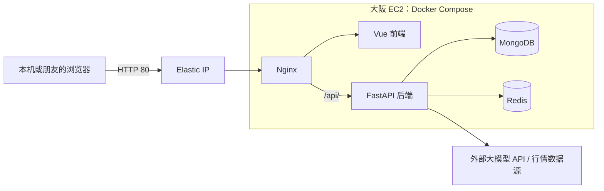
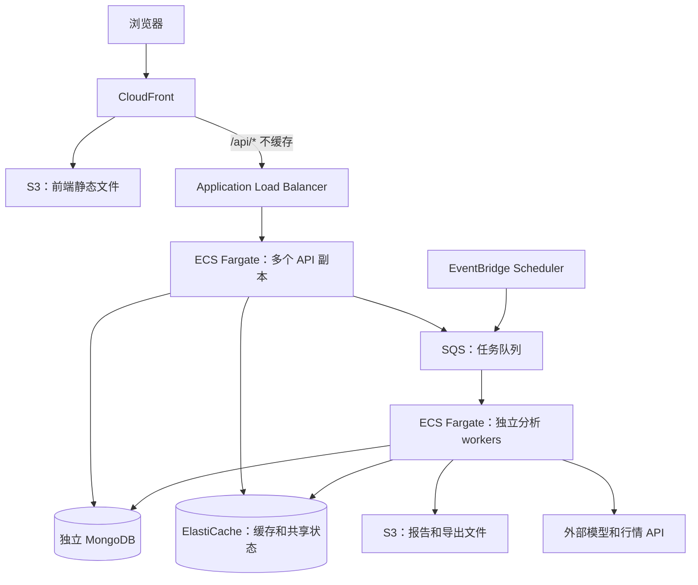
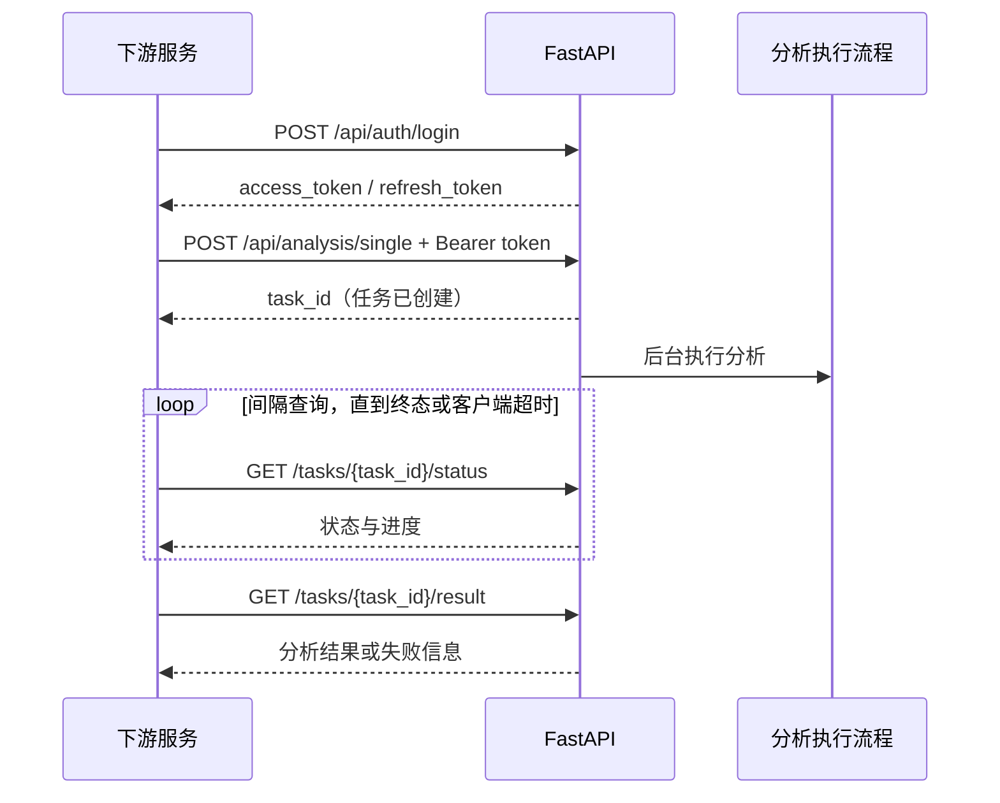
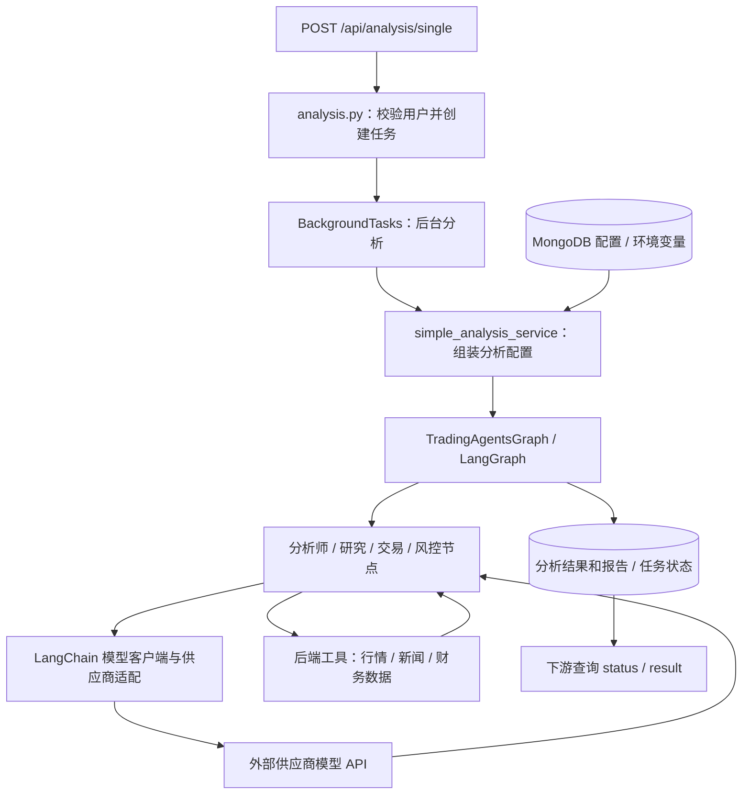

# TradingAgents-CN：本地运行、AWS 部署与演进笔记

记录日期：2026-09-17。适用于本次 Windows + Docker Desktop + AWS 大阪部署。

本文区分“已经完成”“日常操作”“后续建议”。下文的发布、扩容及 CI/CD 示例是待实施方案，不代表这些服务已开通或命令已在生产执行。本文不记录登录密码、API Key、AWS 密钥或 SSH 私钥。

## 0. 先记住当前系统是什么

| 项目 | 本次实际状态 |
|---|---|
| 本地仓库 | `C:\Workspace\TradingAgents-CN` |
| 本地 Docker 网页入口 | `http://localhost`，由 Nginx 转发 |
| AWS 区域 | 大阪 `ap-northeast-3` |
| 云服务器 | EC2 `m7i-flex.large`，2 vCPU / 8 GiB |
| 系统与磁盘 | Ubuntu 22.04 x86_64，80 GiB 加密 gp3 EBS |
| 公网网页 | `http://16.208.96.255` |
| 云端应用目录 | `/opt/tradingagents` |
| 云端应用镜像 | 前后端均为 `hsliup/...:v1.0.0-preview` |
| 容器 | Nginx、前端、后端、MongoDB、Redis，共 5 个 |
| 对外端口 | HTTP 80；SSH 22 只允许 `admin_cidr` 指定的公网 IP |
| DNS / HTTPS | 用户选择暂不配置，使用 IP + HTTP |
| Terraform state | 当前保存在本机；尚未迁移到远程 backend |
| 尚未部署 | ALB、ECS、ECR、托管数据库、自动备份、CI/CD、自动扩缩容 |

已经验证：容器启动、网页 HTTP 200、后端 `/api/health` HTTP 200、管理员登录、厂家及模型目录接口。未登录访问 `/api/auth/me` 返回 401 是正常鉴权行为。尚不能据此认定股票分析、第三方数据源和大模型调用全部验证通过。



## 1. 本地做了哪些修改

### 1.1 Docker Desktop 配套文件

| 文件 | 作用 |
|---|---|
| `docker-compose.desktop.yml` | 覆盖原 Compose 的镜像标签、健康检查及数据库端口映射 |
| `scripts/start_docker_desktop.ps1` | 启动 Docker Desktop，选择 `desktop-linux`，启动容器并检查健康状态 |
| `scripts/init_desktop.py` | 包装镜像内导入工具，使其使用运行配置中的数据库名称和连接参数 |
| `docs/deployment/docker-desktop-local.md` | 本地启动和验证记录 |

具体修正：

- 原配置引用 `v1.0.1`，实际镜像仓库没有该标签，改为已发布的 `v1.0.0-preview`。
- 本地 MongoDB、Redis 不再映射宿主机 27017、6379，容器通过 Compose 网络访问，避免端口冲突。
- 健康检查使用 `127.0.0.1`，解决 `localhost` 被解析成 `::1`、而 Nginx 只监听 IPv4 导致的误报。
- 初始化工具的数据库名与后端统一，避免“导入成功但页面仍没有数据”。

### 1.2 AWS 与 Terraform 文件

| 文件 | 作用 |
|---|---|
| `infra/aws/main.tf` | AWS provider、输入参数、网络、EC2、磁盘、密钥、公网 IP、输出 |
| `infra/aws/bootstrap.sh.tftpl` | 首次开机安装 Docker、写入 Compose、生成服务器密钥、启动应用 |
| `infra/aws/compose.yaml` | 云端专用容器配置；与本地覆盖文件是两套配置 |
| `infra/aws/terraform.tfvars.example` | 可提交的参数模板 |
| `infra/aws/terraform.tfvars` | 当前机器的实际参数；被 Git 忽略 |
| `infra/aws/.terraform.lock.hcl` | 锁定实际 provider 版本，应提交 |
| `infra/aws/init_admin.py` | 仅在没有用户时初始化管理员，并测试登录 |
| `infra/aws/init_providers.py` | 只补齐缺失的厂家、模型目录；不覆盖已有记录、不导入 API 密钥 |
| `infra/aws/.gitignore` | 排除 state、计划、私有参数及初始密码文件 |
| `infra/aws/README.md` | AWS 操作说明与修复记录 |

AWS 的实际修复还包括：放行当前公网 IP 的 SSH；按用户要求开放 HTTP；初始化缺失管理员；补齐 9 个厂家、9 个模型目录。

这些数据库修改是运行时状态变更，不会因为 `git push` 自动重现。新环境仍需要执行初始化脚本。管理员密码后续已经改过，旧初始密码文件不能再作为当前凭证来源。

### 1.3 工作区中需要另行审查的变更

整理笔记时，`frontend/yarn.lock` 已有依赖版本和下载源的修改，`git diff --stat` 显示 100 行新增、96 行删除。这项变更不是本次 AWS 配置修复产生的，提交前应独立审查和验证。

另有未跟踪的 `docker-compose.hub.nginx copy.yml`。当前启动命令不使用这个副本，不应未经审查就把它当作正式配置。

本次没有执行 Git commit 或 push。仓库 HEAD 为 `74783e8`，但这不代表云端 Docker Hub 镜像就是由该提交构建；目前没有建立源代码与镜像的一一对应记录。

## 2. 本地如何启动和管理 Docker

以下命令在 PowerShell 执行。

### 2.1 日常启动

```powershell
cd C:\Workspace\TradingAgents-CN
powershell -ExecutionPolicy Bypass -File scripts/start_docker_desktop.ps1
```

首次空数据库初始化时执行：

```powershell
powershell -ExecutionPolicy Bypass -File scripts/start_docker_desktop.ps1 -Initialize
```

脚本会启动 Docker Desktop、启动容器、等待健康检查，并请求 `http://localhost/api/health`。`-Initialize` 用于初始配置导入，不是每次启动都要执行。

等价的主要 Docker 命令：

```powershell
docker desktop start
docker context ls
docker --context desktop-linux compose -f docker-compose.hub.nginx.yml -f docker-compose.desktop.yml up -d --no-build --wait --wait-timeout 180
docker --context desktop-linux compose -f docker-compose.hub.nginx.yml -f docker-compose.desktop.yml ps
Invoke-RestMethod http://localhost/api/health
```

`-f` 按顺序合并文件，后一个文件覆盖前一个；`--no-build` 使用现成镜像。因此此流程不会把本地源码修改自动编译进镜像。

`http://localhost:3000` 是前端 Vite 开发服务器的默认地址，不能与当前 Docker Nginx 的 80 端口入口混为一谈。

### 2.2 查看、日志、重启、停止

```powershell
# 所有运行中容器 / 包含停止的容器
docker --context desktop-linux ps
docker --context desktop-linux ps -a

# 当前项目的后端日志
docker --context desktop-linux compose -f docker-compose.hub.nginx.yml -f docker-compose.desktop.yml logs --tail 100 backend

# 重启后端
docker --context desktop-linux compose -f docker-compose.hub.nginx.yml -f docker-compose.desktop.yml restart backend

# 停止当前项目，保留容器和数据
docker --context desktop-linux compose -f docker-compose.hub.nginx.yml -f docker-compose.desktop.yml stop

# 停止整个 Docker Desktop
docker desktop stop
```

优先使用项目级 `stop`。`docker kill <容器ID>` 是强制终止单个容器；`docker desktop stop --force --timeout 30` 是此前正常退出卡住时使用的应急操作，不作为日常停止方式。

`compose down` 删除项目容器和网络，通常保留命名卷；`compose down -v` 会删除命名卷，不能在有业务数据时随手执行。

## 3. AWS 部署准备、选型与扩展

### 3.1 为什么选 EC2

最初考虑 Lightsail，是因为单机套餐易于管理和估算费用。但用户指定大阪，AWS Lightsail 支持区域列表不包含大阪，因此改用 EC2。[AWS 区域说明](https://docs.aws.amazon.com/lightsail/latest/userguide/understanding-regions-and-availability-zones-in-amazon-lightsail.html)

先尝试 `t3.large`，AWS 返回当前账号不允许使用该免费套餐之外的规格。随后查询区域支持的免费套餐适用规格，选择同为 2 vCPU / 8 GiB 的 `m7i-flex.large`，创建成功。免费套餐适用仍会消耗额度，不是永久免费的服务器。[EC2 Free Tier 说明](https://docs.aws.amazon.com/AWSEC2/latest/UserGuide/ec2-free-tier-usage.html)

EC2 适合当前阶段：现有 Compose 可直接运行、SSH 排障直观、无需先改造应用。大模型通过外部 API 调用，所以不需要 GPU。代价是单机故障会影响整个服务，系统升级、备份和容器运维由我们负责。

当前成本由 EC2、EBS、公网 IPv4、流量组成，模型 API 另算；不要继续沿用此前 Lightsail 44 美元/月的估算。

### 3.2 已准备的账号和工具

- AWS 账号，以及可创建 EC2/VPC/EBS/安全组等资源的权限。
- AWS CLI v2；本次通过浏览器 `aws login` 获取临时凭证。
- Terraform；初始验证时版本为 1.16.2，AWS provider 锁定为 6.64.0。
- SSH 密钥对；公钥交给 AWS，私钥只保存在本机。
- 当前公网 IPv4，填写为 `x.x.x.x/32`，用来限制 SSH。

本次验证到的 AWS 身份为 root。后续日常管理和 CI/CD 应改为具有所需权限的 IAM 角色或身份，不把 root 会话作为长期发布机制。

### 3.3 如何发展为 stateless 系统

Stateless 指某个 API 实例退出后，其他实例仍能接着处理请求：重要数据不只存在该进程内存或该机器磁盘上。并不是整个系统不保存状态，而是把状态放进独立的存储服务。

当前源码里仍有线程池、进程内跟踪器，以及本机 `data`/`logs` 挂载；因此不能只把后端副本数改成 3 就认为改造完成。云端旧镜像也需要按实际版本复查这些行为。

| 当前关注点 | 横向扩容前要做的事 |
|---|---|
| 用户、配置、分析结果 | 放在所有实例共同访问的数据库 |
| JWT、刷新/撤销状态 | 各副本使用一致的密钥；需要共享的会话状态存入 Redis/数据库 |
| 分析任务运行较久 | API 创建任务并返回 task ID，独立 worker 执行 |
| 任务队列和状态 | 共享队列、明确重试规则、持久化任务状态 |
| 报告与导出文件 | 移到 S3；API 返回对象地址或授权下载链接 |
| 进度 SSE/WebSocket | 共享进度来源和消息通道，支持客户端断线重连 |
| 定时同步任务 | 单独运行调度器，或通过分布式锁防止每个副本重复执行 |
| 日志 | 标准输出集中采集至 CloudWatch，按 request/task ID 追踪 |
| 大模型限额 | 在多个 worker 之间统一控制并发、速率和用户额度 |

增加实例不能解决供应商 429；反而可能因为并发增加而更频繁触发限流。

### 3.4 后续 high-level system design

以下为候选架构，并未部署。使用前应确认大阪区域可用性、账号套餐限制和费用。



| 层次 | 可以选择的服务 | 选型说明 |
|---|---|---|
| 流量入口 | ALB | 按路径转发、实例健康检查；Fargate target group 使用 IP 类型 |
| API / worker | ECS + Fargate | 分开扩缩容，减少宿主机维护；也可用 EC2 Auto Scaling，但需额外设计容器部署和启动流程 |
| 自动扩容 | ECS Service Auto Scaling | API 可参考 CPU/请求量，worker 可参考队列积压；指标和阈值需压测 |
| MongoDB | MongoDB Atlas（运行在 AWS）、独立 EC2 MongoDB 副本集 | 优先考虑 MongoDB 兼容性；自建仍需维护副本集、备份和恢复 |
| AWS 文档数据库 | Amazon DocumentDB | 候选，不是 MongoDB 的无差别替代，需测试查询、索引、事务等兼容性 |
| 关系数据库 | RDS / Aurora PostgreSQL | 仅在计划改造数据模型时考虑，不可直接替换当前 MongoDB 连接串 |
| Redis | ElastiCache for Valkey/Redis OSS | 迁移前核查实际命令、持久化需求、TLS/认证与队列用途 |
| 对象存储 | S3 | 前端构建产物、报告、备份；不是透明的 POSIX 文件系统替代 |
| 队列 | SQS + dead-letter queue | 需要改造当前消费逻辑，不能只改 Redis URL；任务执行必须幂等 |
| 镜像仓库 | ECR | 保存自己构建的镜像，并与代码提交建立对应关系 |
| 密钥与配置 | Secrets Manager / Parameter Store | 用 IAM role 获取；多个实例共享版本化的运行配置 |
| 监控 | CloudWatch Logs、Metrics、Alarm | 观察错误率、任务耗时、数据库压力、模型限流 |
| 域名和证书 | Route 53 / 现有 DNS + ACM | 以后需要域名/HTTPS 再增加；当前没有启用 |

ECS 自动扩容会调整 task 数量，但应用必须先具备多副本能力。[ECS 扩容说明](https://docs.aws.amazon.com/AmazonECS/latest/developerguide/service-auto-scaling.html)、[ALB 与 ECS](https://docs.aws.amazon.com/AmazonECS/latest/developerguide/alb.html)

DocumentDB 与 MongoDB 存在明确功能差异，迁移要做回归测试。[兼容性差异](https://docs.aws.amazon.com/documentdb/latest/devguide/functional-differences.html)

SQS Standard 存在至少一次投递，因此用 task ID、数据库状态迁移、去重或租约机制防止重复分析和重复计费；长任务还需延长 visibility timeout。[SQS 投递语义](https://docs.aws.amazon.com/AWSSimpleQueueService/latest/SQSDeveloperGuide/standard-queues-at-least-once-delivery.html)

网络演进：ALB 放公有子网，API、worker、数据库放私有子网，跨至少两个可用区。worker 调用互联网模型 API 需要出站路径；NAT Gateway 和 VPC endpoint 都需要单独评估费用。不要为了“看起来完整”一次性开通所有服务。

建议顺序：先做数据库备份及恢复演练 → 数据库与应用分离 → 状态和文件外置 → API/worker 解耦 → ALB 多副本 → 自动扩缩容。

## 4. Terraform 准备事项与编写逻辑

### 4.1 AWS 登录与 SSH 解锁

```powershell
aws --version
terraform version
aws login --profile tradingagents-login
# 如果询问区域，填写 ap-northeast-3

aws configure set credential_process "aws configure export-credentials --profile tradingagents-login --format process" --profile tradingagents
aws configure set region ap-northeast-3 --profile tradingagents
$env:AWS_PROFILE = 'tradingagents'
aws sts get-caller-identity
```

`tradingagents-login` 保存交互登录配置；`tradingagents` 通过 credential_process 向 CLI 取得临时凭证，供 Terraform 使用。会话过期时重新 `aws login`，不需要创建长期 Access Key。[AWS 登录说明](https://docs.aws.amazon.com/cli/latest/userguide/cli-configure-sign-in.html)

如果当前终端找不到刚安装的 AWS CLI，重开 PowerShell；或在当前会话执行：

```powershell
$env:Path = 'C:\Program Files\Amazon\AWSCLIV2;' + $env:Path
```

首次生成 SSH 密钥，仅在目标文件不存在时执行：

```powershell
ssh-keygen -t ed25519 -f "$env:USERPROFILE\.ssh\tradingagents"
```

私钥有密码且需要非交互连接时，在管理员 PowerShell 启动 agent，再加载密钥：

```powershell
Set-Service ssh-agent -StartupType Manual
Start-Service ssh-agent
ssh-add "$env:USERPROFILE\.ssh\tradingagents"
```

### 4.2 填参数和部署

```powershell
cd C:\Workspace\TradingAgents-CN\infra\aws
# 首次才复制；不要覆盖已经配置好的 terraform.tfvars
Copy-Item terraform.tfvars.example terraform.tfvars
notepad terraform.tfvars
(Invoke-RestMethod https://checkip.amazonaws.com).Trim()
```

实际参数示意：

```hcl
region              = "ap-northeast-3"
instance_type       = "m7i-flex.large"
ssh_public_key_path = "~/.ssh/tradingagents.pub"
admin_cidr          = "你的公网IPv4/32"
```

注意 `main.tf` 和模板仍默认 `t3.large`，本次实际配置由私有 `terraform.tfvars` 覆盖成 `m7i-flex.large`。

```powershell
terraform init
terraform fmt -check
terraform validate
terraform plan '-input=false' '-out=deploy.tfplan'
terraform apply 'deploy.tfplan'
terraform output
```

PowerShell 下把 `-out=deploy.tfplan` 整体加引号，避免此次遇到的参数解析错误。`plan` 用于检查将做什么；`apply` 才创建或修改资源。保存的 plan 应在短时间内使用；代码、参数或云端状态变更后重新生成，不复用旧计划。

### 4.3 main.tf 的依赖关系

```text
AWS provider（区域、认证、公共标签）
 ├─ 查询可用区与 Canonical Ubuntu AMI
 ├─ VPC → Subnet
 ├─ VPC → Internet Gateway → Route Table → Subnet Association
 ├─ VPC → Security Group
 └─ 本机 SSH 公钥 → AWS Key Pair
                    ↓
              EC2 + 根 EBS
                    ↓
                Elastic IP
```

共 9 个 Terraform managed resource；根磁盘由 EC2 的 `root_block_device` 管理，不是另一个独立的 Terraform resource。AMI 和可用区是 data source，只查询，不创建。

关键逻辑：

- 独立 VPC，不依赖账号是否存在 default VPC。
- 默认路由 `0.0.0.0/0` 指向 Internet Gateway，EC2 具有公网访问能力。
- 安全组：80 对公网开放；22 只允许 `admin_cidr`；数据库端口不开放。
- `depends_on` 确保路由关联就绪后创建实例，供初始化下载软件和镜像。
- `templatefile` 将 Compose/Nginx 配置的 Base64 内容嵌入启动脚本；Base64 不是加密，这里不嵌入秘密。
- 启动时用 OpenSSL 在服务器生成 MongoDB、Redis、JWT、CSRF 密钥，写入权限 600 的 `.env`。
- `prevent_destroy = true` 阻止意外通过 Terraform 删除或替换实例，不阻止 AWS 控制台操作。
- 根磁盘 `delete_on_termination = false`，实例终止后保留数据盘，但保留磁盘仍可能计费，也不等于备份。
- `ignore_changes = [ami, user_data]` 避免镜像查询结果/启动模板变化导致现有机器替换。它也意味着修改启动脚本不会自动更新已运行的应用。
- T3 才配置 standard CPU credits；本次 M7i-flex 不使用这一设置。

### 4.4 基础设施初始化不等于业务初始化

`bootstrap.sh.tftpl` 安装 Docker、生成密钥、启动容器；目前没有自动执行 `init_admin.py` / `init_providers.py`。首次新部署后还要执行这两个脚本。

```powershell
# 在仓库根目录；仅给新环境初始化，已有数据时脚本会跳过或拒绝覆盖
scp -i "$env:USERPROFILE\.ssh\tradingagents" infra/aws/init_admin.py infra/aws/init_providers.py ubuntu@16.208.96.255:/home/ubuntu/
ssh -i "$env:USERPROFILE\.ssh\tradingagents" ubuntu@16.208.96.255
```

进入 Ubuntu 后执行：

```bash
sudo docker exec -i tradingagents-backend-1 python - < /home/ubuntu/init_admin.py
sudo docker exec -i tradingagents-backend-1 python - < /home/ubuntu/init_providers.py
```

管理员脚本只支持空用户集合，不是密码重置脚本；厂家脚本使用 `$setOnInsert`，反复执行不覆盖现有厂家。导入目录后仍需自己填写模型 API Key 并启用。

首次 cloud-init 因不存在的镜像标签而失败，后续通过 SSH 修复；历史 `cloud-init status` 可能仍为 error。因此检查修复后的实际容器和 API，而不是仅看这个历史状态。

### 4.5 state 与团队协作

当前 state 在本机，必须保留并安全备份；丢失 state 会让 Terraform 失去与已有资源的映射。不要提交 `.tfstate`、`.tfplan`、私钥、密码文件；提交 `.tf`、模板和 `.terraform.lock.hcl`。

后续可迁移到预先创建的 S3 bucket：启用版本控制、加密、限制 IAM 权限，并使用 `use_lockfile = true` 防止多人同时修改同一 state。迁移使用 `terraform init -migrate-state`，不是删除本地 state 再重新 apply。较新 Terraform 支持 S3 原生锁；DynamoDB 锁方案已经弃用，新项目不用为了锁而新增 DynamoDB 表。[S3 backend 文档](https://developer.hashicorp.com/terraform/language/backend/s3)

## 5. 代码变更如何同步到云端

### 5.1 四类变更，四种发布动作

| 变更 | 应执行的动作 |
|---|---|
| 实例、磁盘、安全组、网络 | 修改 `.tf` / 参数 → plan → apply |
| Python/Vue 业务代码 | 构建新镜像 → 传输/推送 → 更新 Compose 镜像引用 → 重建相应容器 |
| Compose / Nginx / 运行环境配置 | 上传配置 → 按需要重建或 reload；不要覆盖云端 `.env` |
| 用户、厂家、模型、数据库结构 | 通过管理 API 或版本化迁移脚本更新；先备份并验证兼容性 |

`git push` 只更新代码仓库。`docker restart` 不会更新镜像。`docker compose pull` 只拉镜像，之后还要 `up -d` 才会用新镜像重建。当前 Terraform 忽略 user_data 更新，`terraform apply` 也不会发布 Python/Vue 改动。

### 5.2 单机阶段：构建镜像并通过 SSH 传输

以下是尚未执行的发布流程示例。先审查并提交准备发布的源码、确认工作区干净，检查 Dockerfile 和 `.dockerignore`；当前后端 Dockerfile 会把 `.env.docker` 复制进镜像，发布前确认其中没有真实密钥，运行时秘密应通过服务器配置注入。构建上下文也不应包含 `infra/aws` 下的 state 或凭证文件。

本机 PowerShell：

```powershell
cd C:\Workspace\TradingAgents-CN
docker desktop start
$release = git rev-parse --short HEAD
docker --context desktop-linux build --platform linux/amd64 -f Dockerfile.backend -t "tradingagents-backend:$release" .
# 上一条成功后再执行下一条；前端修改也需要重新构建
docker --context desktop-linux build --platform linux/amd64 -f Dockerfile.frontend -t "tradingagents-frontend:$release" .
docker --context desktop-linux save -o "$env:TEMP\tradingagents-$release.tar" "tradingagents-backend:$release" "tradingagents-frontend:$release"
scp -i "$env:USERPROFILE\.ssh\tradingagents" "$env:TEMP\tradingagents-$release.tar" ubuntu@16.208.96.255:/home/ubuntu/
```

每一步都应确认成功再继续，构建报错不能继续发布旧镜像。这个流程只证明可发布自己的构建产物，不能代替单元测试、前端构建验证和完整分析回归测试。

把 `infra/aws/compose.yaml` 的前后端 `image` 改成刚才的具体标签，例如 `tradingagents-backend:abc1234` / `tradingagents-frontend:abc1234`，并给这两个服务配置 `pull_policy: never`，表示使用手动加载的本地镜像。

```powershell
scp -i "$env:USERPROFILE\.ssh\tradingagents" infra/aws/compose.yaml ubuntu@16.208.96.255:/home/ubuntu/compose.next.yaml
ssh -i "$env:USERPROFILE\.ssh\tradingagents" ubuntu@16.208.96.255
```

服务器 Ubuntu shell，示例中的 `abc1234` 必须替换为实际标签：

```bash
sudo docker load -i /home/ubuntu/tradingagents-abc1234.tar
sudo cp /opt/tradingagents/compose.yaml /opt/tradingagents/compose.previous.yaml
sudo install -m 600 /home/ubuntu/compose.next.yaml /opt/tradingagents/compose.yaml
sudo docker compose --project-directory /opt/tradingagents -f /opt/tradingagents/compose.yaml config --quiet
sudo docker compose --project-directory /opt/tradingagents -f /opt/tradingagents/compose.yaml up -d --no-build --wait --wait-timeout 600
# 当前 Nginx 使用静态 upstream；后端容器 IP 改变后重启网关重新解析
sudo docker compose --project-directory /opt/tradingagents -f /opt/tradingagents/compose.yaml restart nginx
curl -f http://127.0.0.1/api/health
```

替换配置前先完成必要的数据备份。不要删除 `.env`、命名卷、`data`；单机容器重建可能有短暂停机。之后还要测试登录、厂家列表、任务提交及报告，而不只测试 health。

若仅更新 Compose 配置，跳过构建与 `docker save/load`，但远端配置仍需上传并执行 `up -d`。如果是 Nginx 配置更新，上传后先执行 `nginx -t` 再 reload/restart。

### 5.3 后续推荐：ECR + 自动发布

长期流程：Git commit → CI 测试 → 构建前后端镜像 → 推送 ECR → 测试环境验证 → 发布生产环境 → 记录版本。

需要新增 ECR 仓库、发布权限，以及服务器/任务拉取镜像的 IAM role。当前 EC2 尚未配置 instance profile，不能假定它已能拉取私有 ECR 镜像。不要把本机 AWS 长期密钥复制到服务器。

ECR 登录命令示意（前提：仓库和权限已建立）：

```powershell
$region = 'ap-northeast-3'
$accountId = aws sts get-caller-identity --query Account --output text
$registry = "$accountId.dkr.ecr.$region.amazonaws.com"
aws ecr get-login-password --region $region | docker --context desktop-linux login --username AWS --password-stdin $registry
# 镜像需先 tag 为实际 ECR 仓库地址，再 docker push
```

使用 ECR 时移除前述离线传输方案的 `pull_policy: never`，再在部署侧拉取指定版本。ECR 的认证和 push 流程见 [官方指南](https://docs.aws.amazon.com/AmazonECR/latest/userguide/getting-started-cli.html)。

GitHub Actions 可用 OIDC 换取临时 AWS 凭证，将权限限制到指定仓库、分支或 environment，无需在 GitHub 保存长期 AWS secret。[GitHub OIDC 官方说明](https://docs.github.com/en/actions/how-tos/secure-your-work/security-harden-deployments/oidc-in-aws)

## 6. 后续版本管理

### 6.1 将源代码、镜像、部署记录关联起来

每次发布至少记录：

```text
应用版本：例如 v1.1.1（示例，不代表已经发布）
Git commit：完整提交 SHA
backend image：仓库地址 + 不可变标签或 digest
frontend image：仓库地址 + 不可变标签或 digest
部署环境 / 时间 / 操作者
配置与数据库迁移版本
验证结果
回滚目标镜像和对应 Compose
```

不要只记录 `latest`。相同 tag 可能被重新推送；digest（`image@sha256:...`）更准确地指向具体镜像。当前上下游版本号并不一致，不能把 README 的 v1.1.0、Python 包版本和云端镜像标签当作同一件事。

### 6.2 提交策略

- `main` 保持可发布；功能/修复使用短期分支，审查后合并。
- 将“部署文件”“依赖升级”“业务代码”分开提交，便于定位和回滚。
- 审查 `frontend/yarn.lock` 后再决定是否提交，不要与基础设施修改无说明地混在一起。
- 显式 `git add` 所需文件，避免直接把当前所有未跟踪文件都提交。
- 数据库里的密码、厂家 API Key 和 Terraform state 不属于版本库内容。
- 当前开发、本地测试、云端生产应各用独立配置和数据；引入 staging 后也应独立 state。

发布前检查示例：

```powershell
git status --short
git diff --stat
git diff --check
git check-ignore infra/aws/terraform.tfvars infra/aws/terraform.tfstate infra/aws/admin-initial-password.txt
terraform -chdir=infra/aws fmt -check
terraform -chdir=infra/aws validate
```

`fmt` / `validate` 只检查 Terraform 结构，不证明 AWS 权限、区域容量、容器初始化或业务功能正确。

### 6.3 回滚逻辑

代码回滚：恢复上一份 Compose 中的镜像版本，确保旧镜像仍可用，再执行 `up -d` 并检查 Nginx upstream、API 和登录。Git revert 本身不会回滚已经运行的容器。

数据库回滚：不是换回旧镜像就能自动完成。优先使用向后兼容的迁移（先增加字段/索引，再逐步切换使用）；破坏性变更需要单独备份、恢复流程和数据损失评估。

基础设施回滚：改回 `.tf` 并查看新 plan；不要手工把旧 `.tfstate` 覆盖到当前 state 来“回滚”。

## 7. 排障速查和此次踩坑

| 现象 | 此次原因 / 应检查什么 | 处理 |
|---|---|---|
| 网页到底用 3000 还是 80 | 开发服务器与 Docker 入口混淆 | 当前本地 Docker 用 localhost，云端用公网 IP 的 80 |
| Docker CLI 无响应 | Desktop 后台卡住 | 先正常停止；强制关闭只用于确认后的应急处理 |
| 镜像拉取 not found | `v1.0.1` 标签未发布 | 使用存在的标签；下次发布前校验镜像 |
| 容器健康检查失败但网页能打开 | localhost 解析到 IPv6 | 探针使用 `127.0.0.1` |
| EC2 创建被拒 | t3.large 不符合当前免费套餐限制 | 改为实际可用的 m7i-flex.large |
| SSH 超时 | 家庭公网 IP 变化，安全组仍放行旧 IP | 更新 admin_cidr，plan/apply |
| SSH publickey 失败 | 公钥已被接受，但加密私钥未解锁 | 启动 ssh-agent 并 ssh-add |
| AWS session expired | 临时凭证过期 | 重新 aws login |
| 登录报密码错误 | 初始用户集合为空 | 执行空库管理员初始化；不能仅靠重启 |
| 厂家页面为空 | 未导入厂家/模型种子数据 | 执行增量初始化；不要覆盖已有 API Key |
| /auth/me 返回 401 | 请求没有 Bearer Token | 登录后携带 token；不是服务器断线 |
| 模型 API 返回 429 | 上游额度或速率限制，需要错误细节判断 | 查看供应商错误码；增加 EC2 配置无法消除上游限额 |
| 本地修改云端没有变化 | 云端运行旧镜像 | 构建、发布、更新镜像并重建容器 |

日常云端检查：

```powershell
Invoke-RestMethod http://16.208.96.255/api/health
ssh -i "$env:USERPROFILE\.ssh\tradingagents" ubuntu@16.208.96.255
```

服务器执行：

```bash
sudo docker compose --project-directory /opt/tradingagents -f /opt/tradingagents/compose.yaml ps
sudo docker compose --project-directory /opt/tradingagents -f /opt/tradingagents/compose.yaml logs --tail 100 backend
df -h
```

当前公开的是 HTTP，不能提供传输加密；数据库仍只在容器网络中访问。后续正式长期使用时，再安排域名/HTTPS、独立朋友账号、备份恢复和模型调用额度控制。

## 8. FastAPI 接口在哪里，以及如何与下游系统集成

### 8.1 区分接口地址、代码和 API 文档

当前公网接口基础地址：`http://16.208.96.255/api`。下游服务无需通过前端页面，可以直接发送 HTTP 请求。

| 查找内容 | 本地源码入口 |
|---|---|
| FastAPI 初始化、路由前缀注册 | [app/main.py](../../app/main.py) |
| 登录、Token、刷新与用户接口 | [auth_db.py](../../app/routers/auth_db.py) |
| 分析任务的创建、查询、取消 | [analysis.py](../../app/routers/analysis.py) |
| 请求参数和任务状态枚举 | [models/analysis.py](../../app/models/analysis.py) |
| 报告详情、内容和下载 | [reports.py](../../app/routers/reports.py) |
| 厂家、模型与配置管理 | [config.py](../../app/routers/config.py) |
| SSE 任务进度接口 | [sse.py](../../app/routers/sse.py) |

完整路径由 router 自身路径与 `app.include_router(..., prefix=...)` 组合。例如分析 router 的 `/single` 加上 `/api/analysis`，得到 `/api/analysis/single`。

本地代码中 `/docs`、`/redoc` 仅在 `DEBUG=true` 时启用。当前 Nginx 把 `/api/` 转发给后端，其他路径转发给前端。此前实测公网 `/docs` 和 `/openapi.json` 都返回 `text/html`，不是可用的 Swagger/OpenAPI 文档；不能只凭 HTTP 200 判断它们正常。

云端运行的镜像版本早于当前本地源码。下表和示例按本地源码整理，最终字段、响应格式、状态枚举应以实际运行版本的 OpenAPI 和联调结果为准。此前厂家接口已观察到旧版本直接返回列表，而本地源码有包装响应，不能假设所有接口总是 `success/data/message` 格式。

### 8.2 导出实际运行版本的 OpenAPI

优先导出 schema，再导入 Postman、Apifox 或用于生成客户端；不必为了查看 API 文档而打开生产 DEBUG。

本机登录服务器：

```powershell
ssh -i "$env:USERPROFILE\.ssh\tradingagents" ubuntu@16.208.96.255
```

在服务器执行：

```bash
sudo docker exec tradingagents-backend-1 \
  curl -fsS http://127.0.0.1:8000/openapi.json \
  > /home/ubuntu/openapi.json
```

回到本机 PowerShell，在需要存放文件的目录执行：

```powershell
scp -i "$env:USERPROFILE\.ssh\tradingagents" ubuntu@16.208.96.255:/home/ubuntu/openapi.json ./openapi.json
```

导出后检查内容是含 `openapi`、`paths`、`components` 的 JSON，不是前端 HTML。上次尝试导出时 SSH 超时，尚未成功取得云端 schema；以上是待执行操作，不是已有导出文件。SSH 不通时按第 7 节检查公网 IP 和安全组。

### 8.3 常用 REST 接口清单

| 方法 | 路径 | 集成用途 |
|---|---|---|
| GET | `/api/health` | 基础健康检查 |
| POST | `/api/auth/login` | 用户名密码登录，获取 access/refresh token |
| POST | `/api/auth/refresh` | 刷新登录凭证 |
| GET | `/api/auth/me` | 验证 token 并取得用户信息 |
| POST | `/api/analysis/single` | 提交单股分析，取得 task ID |
| POST | `/api/analysis/batch` | 提交批量分析 |
| GET | `/api/analysis/tasks/{task_id}/status` | 查询任务状态与进度 |
| GET | `/api/analysis/tasks/{task_id}/result` | 读取分析结果 |
| GET | `/api/analysis/tasks` | 查询任务列表 |
| POST | `/api/analysis/tasks/{task_id}/cancel` | 请求取消任务，具体可取消阶段以实现为准 |
| GET | `/api/reports/list` | 查询报告列表 |
| GET | `/api/reports/{report_id}/detail` | 读取报告详情 |
| GET | `/api/reports/{report_id}/download` | 下载报告，参数见该版本 schema |
| GET | `/api/config/llm/providers` | 查询厂家配置 |
| GET | `/api/config/model-catalog` | 查询模型目录 |
| GET | `/api/stream/tasks/{task_id}` | SSE 进度订阅；需确认与任务创建路径兼容 |

不要假设 `report_id` 与 `task_id` 相同。根据任务结果或报告列表获取真正的报告 ID。

SSE 路由在当前代码中使用 QueueService 查询任务及所属用户，而 `/analysis/single` 使用另一条分析服务路径。下游首版集成优先轮询 status/result，待验证同一 task ID 可用于 SSE 后再切换；不能因两者都叫任务接口就认定存储路径一致。

### 8.4 鉴权与异步调用示例



登录请求：

```http
POST /api/auth/login
Content-Type: application/json

{"username":"integration-user","password":"替换为该账号密码"}
```

已验证的登录响应中，token 位于 `data.access_token`。业务请求携带：

```http
Authorization: Bearer <access_token>
```

单股请求示例，两个模型名必须替换成实际已启用并有调用权限的模型 ID：

```json
{
  "symbol": "000001",
  "parameters": {
    "market_type": "A股",
    "research_depth": "标准",
    "selected_analysts": ["market", "fundamentals"],
    "quick_analysis_model": "实际快速模型ID",
    "deep_analysis_model": "实际深度模型ID"
  }
}
```

当前本地实现返回 `data.task_id`，创建成功并不代表分析完成；状态达到成功终态后再读取结果。轮询间隔可从 3–5 秒开始，设置总等待上限，识别失败/取消状态并停止轮询。准确的终态字符串以运行版本定义为准。

### 8.5 下游接入约定

- 使用独立集成账号，不让业务服务共享管理员账号。现有机制是用户登录 JWT，尚未实现专门的机器身份/OAuth client-credentials 流程。
- 不要把登录密码、access token 或供应商 API Key 写进 Git、URL、常规日志。
- 对只读查询可有限重试；创建分析 POST 发生超时后，先核对任务是否已经创建，避免重复调用。当前不应假设接口原生支持 `Idempotency-Key`。
- 下游保存自己的业务 ID 与本系统 task ID 的映射；记录脱敏请求参数、提交时间和最终状态。
- HTTP 200、任务创建成功、分析任务成功是三个不同层次，需要分别判断。
- 401 检查/刷新 token；403 检查权限；参数错误按响应详情修正。上游模型错误也可能表现为任务失败，不能只根据提交接口 HTTP 状态判断。
- 服务器到服务器调用不受浏览器 CORS 限制；若由其他网站的浏览器直接调用，则还需核查 CORS。
- 当前应用入口使用 HTTP；不要把这误认为 token 已得到传输加密。后续 HTTPS 改造要同步更新下游 base URL。
- 尚未验证自动 webhook 回调流程；当前建议采用提交后轮询，再由下游自行触发后续业务。

## 9. 后端如何与外部大模型交互

### 9.1 两条调用链与两种凭证

```text
下游服务 → FastAPI：使用本项目登录产生的 JWT
FastAPI 分析流程 → 外部模型供应商：使用供应商 API Key
```

两种凭证不能互换。下游正常提交分析只需本项目账号的 token，不需要在每个请求里传供应商密钥。模型供应商 Key 由后端从配置/运行环境获取。网页请求本项目的 API；实际模型调用在后端发生。

本项目是编排和调用外部模型，不在 EC2 中训练或加载一个完整大模型，因此本次未购买 GPU、SageMaker 或 Bedrock。已有供应商 API 不能因为部署到了 AWS 就自动变成 Bedrock 调用。

### 9.2 配置分为厂家、模型与本次任务三个层次

| 层次 | 主要内容 | 作用 |
|---|---|---|
| 厂家配置 | 厂家标识、默认 API 地址、API Key、是否启用 | 告诉后端向哪里请求、如何认证 |
| 模型配置/目录 | 模型 ID、所属厂家、能力、timeout/max_tokens 等 | 确定具体模型和调用参数；目录不等于模型已可调用 |
| 分析请求 | 快速模型、深度模型、分析师、研究深度、股票和日期 | 决定这次工作流使用哪些模型与节点 |

当前代码优先考虑任务指定的模型组合，进行能力检查；未明确指定或不满足条件时，相关服务可以按研究深度推荐已启用模型或回退到系统默认。请求模型本身也有默认值，因此“不传模型参数”不等同于“绝不触发默认模型”。集成时显式传入已配置的模型更易追踪。

配置装配主要在 `app/services/simple_analysis_service.py`：查询模型与厂家信息，设置 `quick_provider`、`deep_provider`、各自 `backend_url` 和 `api_key`，读取 temperature、max_tokens、timeout、reasoning_effort 等参数。代码意图是模型级配置优先于厂家默认，再回退环境变量；不同供应商分支和旧镜像版本仍需分别核查，不能当作完全相同的行为保证。

快速模型与深度模型可以来自不同供应商。当前本地 graph 配置中，分析师、多空研究员、交易员和风险讨论节点主要使用快速模型；研究经理和风险经理使用深度模型。“快速/深度”是工作流角色，不是供应商 API 的固定参数。

### 9.3 一次分析的代码调用链



对应代码阅读顺序：

1. [分析路由](../../app/routers/analysis.py)：创建任务、通过 FastAPI `BackgroundTasks` 启动后续执行，先返回 task ID。
2. [分析服务](../../app/services/simple_analysis_service.py)：模型选择、参数组装、工作线程、调用 graph、记录进度和结果。
3. [模型能力服务](../../app/services/model_capability_service.py)：检查或推荐快速/深度模型组合。
4. [TradingAgentsGraph](../../tradingagents/graph/trading_graph.py)：创建快速/深度 LLM，并运行分析工作流。
5. [GraphSetup](../../tradingagents/graph/setup.py)：将各类 agent 和工具节点连成 LangGraph 状态图。
6. [客户端工厂](../../tradingagents/llm_clients/factory.py)：按供应商创建 OpenAI-compatible、Google、Anthropic 客户端。
7. [OpenAI-compatible 客户端](../../tradingagents/llm_clients/openai_client.py) 与 [适配器目录](../../tradingagents/llm_adapters)：处理 SDK 对象、内容格式和供应商差异；旧路径与新版工厂均存在，不是每个调用都依次经过所有文件。
8. [市场分析师示例](../../tradingagents/agents/analysts/market_analyst.py)：可看到 `prompt | llm.bind_tools(tools)`、`chain.invoke(...)` 和 `llm.invoke(...)`。

这里的 BackgroundTasks 属于当前服务进程中的后台执行，不是已经接入了 SQS 或一个持久化外部任务系统。进程重启恢复、任务重复和多副本调度仍是第 3 节演进需要解决的内容。

### 9.4 模型实际收到了什么

模型调用通常由以下信息组成：模型 ID、system/user 等消息、任务提示词、已获取的市场数据和前序分析、可调用工具的描述，以及模型支持的采样/输出限制参数。SDK 根据供应商和 base URL 发送 HTTP 请求。

以常见 OpenAI-compatible 对话格式示意，实际 endpoint、字段和支持能力以选用客户端及供应商为准：

```json
{
  "model": "已配置的模型ID",
  "messages": [
    {"role": "system", "content": "分析师角色和任务要求"},
    {"role": "user", "content": "股票、日期、行情和待分析问题"}
  ],
  "temperature": 0.1,
  "max_tokens": 2000
}
```

这只是说明消息结构，不是应直接复制到 `/api/analysis/single` 的请求体。并非每个模型都接受 temperature、max_tokens 或工具调用；代码中的兼容处理、供应商限制和模型能力必须一起核查。

工具调用并不是让供应商直接连接我们的 MongoDB。后端通过 `bind_tools` 告诉模型有哪些工具；模型可以返回工具名和参数，由本项目执行数据查询，再把工具结果作为消息放回后续模型上下文。多轮调用后才形成分析报告。

因此，一次“单股分析”可能产生多次模型 HTTP 请求：多个分析师、多空辩论、研究经理、交易判断和风控讨论都会贡献调用次数。研究深度会调整讨论轮次、记忆等配置；不能把一次业务任务等同于一次模型计费请求。

### 9.5 配置与排障要点

| 现象 | 优先检查 |
|---|---|
| 厂家列表有记录但无法调用 | Key 是否有效、厂家/模型是否启用、模型 ID 是否可用 |
| 请求发到错误地址 | 模型是否设置了自己的 API 地址，覆盖了厂家默认值 |
| 快速模型成功，深度模型失败 | 两套模型可能使用不同厂家、Key、URL 和权限 |
| 工具调用错误 | 模型是否支持 tools/function calling，适配器是否处理返回格式 |
| 401 / 403 来自模型供应商 | 供应商 Key、权限、地址，不是本项目 JWT |
| 429 | 区分额度不足与速率限制；控制全局并发并查看上游错误详情 |
| 超时 / 5xx | 网络出站、供应商状态、超时设置；重试需有上限 |
| 返回内容为空或结构异常 | 模型/SDK 返回格式、推理内容与最终答案处理、结构校验 |
| 已返回 task ID 但无结果 | 检查后台任务失败信息和日志，不要只看提交接口成功 |

重试策略应区分可恢复的限流/临时故障与不可恢复的凭证、额度问题。多个重试层（SDK、agent、业务任务）叠加可能放大请求量和费用；当前未证明所有供应商路径都实现了统一重试或全局限流。

日志应记录 task ID、供应商、模型名、耗时、错误码和可用的 token usage，避免记录完整密钥或敏感提示词。当前代码中存在 token 使用统计逻辑，但并非所有路径/供应商都保证返回完整 usage；应用估算费用仍需与供应商账单核对。

从后端发往供应商的 URL 可使用 HTTPS，与目前浏览器访问应用的 HTTP 是两段独立链路。发给模型的提示词、行情材料和前序报告会离开服务器进入所配置的供应商服务；接入下游业务数据时应清楚哪些内容进入了提示词。

以上交互实现依据当前本地源码阅读整理。云端仍是 `v1.0.0-preview` 镜像，工厂、适配器和路由实现可能不同；下一次发布自己的镜像时，应记录代码 SHA、镜像 digest、OpenAPI 快照和一次完整分析的回归结果。
